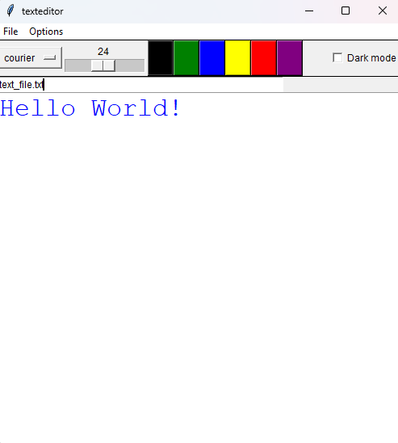
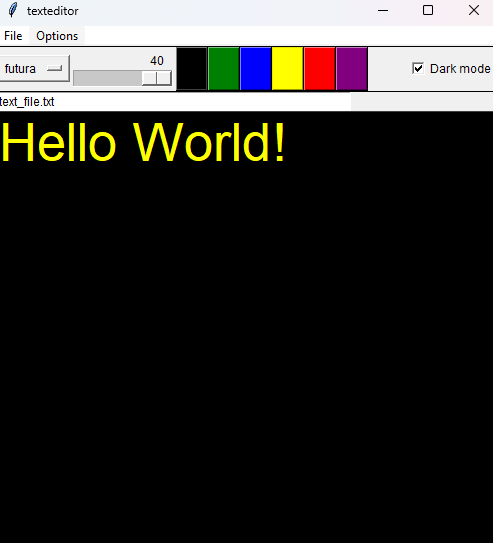

# Pet-progect_Python-word

##📝 TextEditor program
A simple desktop application for editing text files, with visual style customization elements. Designed for quick text entry and formatting.

##💡 Interface features:
- 🔠 Font selection
- 🔢 Text size selection
- 🎨 Text color
- 🌗 Dark theme
- 📄 Editable file
- ✍️ Content

## 🖼️ Screenshots

